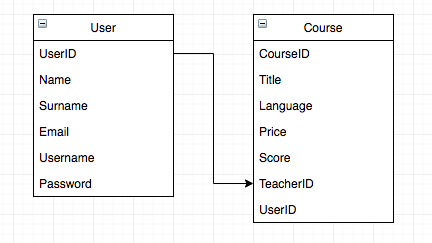
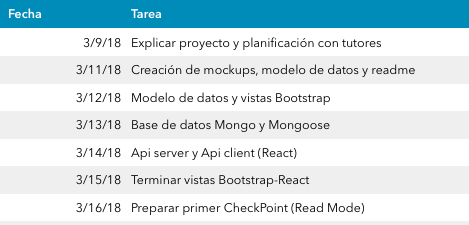

# DevLerning

## About What

>Do you need to improve as a developer?
Are you tired to look for the best video tutorial on YouTube?
'DevLearning' is exactly what you are looking for.
Even if you are a developer who needs to achieve their goals or you are a master who enjoys teaching other people, this is your website.
In 'DevLearning' we get in touch people who need to improve with people who want to give classes.
***

## Data Model

***

## Views

***

## Planning

***

## Tecnologies

In my project, I will put into practice as many technologies as I have been learning in the Bootcamp as:
- HTML5
- CSS
- Bootstrap
- Jasmine
- React
- Node
- Express
- MongoDB
- Mongoose